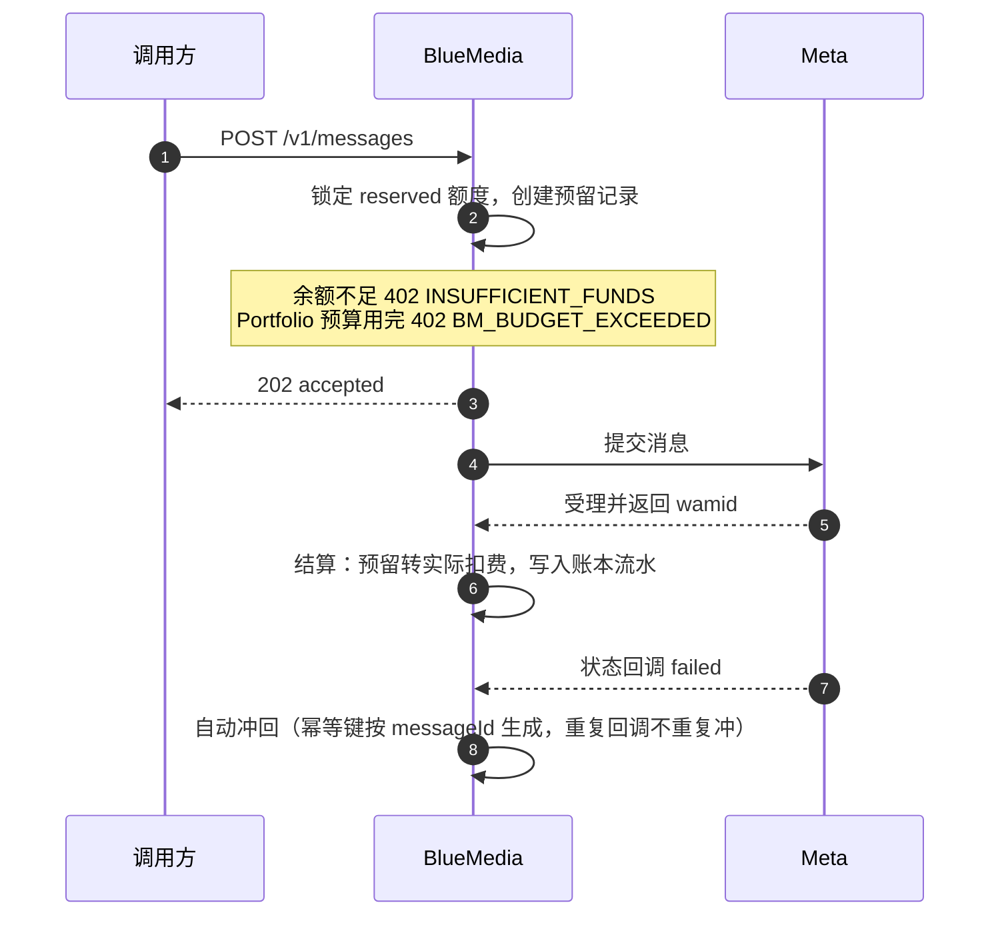

每个客户账户的话费管理采用「信用账户 + 追加式账本」：发送前预留额度，Meta 受理后结算扣费，投递失败自动冲回。所有金额都是最小货币单位的整数（minor units）。

## 信用账户

`GET /v1/credit-account` 返回币种、可用余额、预留余额三个字段。账户尚未开通额度时返回 **404，而不是全零余额**——调用方要用状态码区分"没开通"和"余额为零"。如需开通或调整账户额度，请联系 BlueMedia 支持人员。

## 账户额度与 Portfolio 预算

账户只有一个总余额；每个 Business Portfolio 可以在这个余额之上设置独立的**预算上限**，但它不是第二个钱包。调整 Portfolio 预算不会改变账户总余额，也没有“转入”或“转回”的动作。

| 状态                   | 含义                                                                                          |
| ---------------------- | --------------------------------------------------------------------------------------------- |
| `allocatedMinor: null` | **不限额**：没有为这个 Portfolio 设过上限，只受账户余额约束。                                 |
| `allocatedMinor: 0`    | **冻结**：这个 Portfolio 一分钱都不能花。与“不限额”是相反的意思，别混用。                     |
| 剩余额度               | `allocatedMinor − spentMinor − reservedMinor`；`reservedMinor` 是已发出、尚未结算的冻结部分。 |

:::warning

Portfolio 预算用完时，发送以 `402 BM_BUDGET_EXCEEDED` 失败；账户总余额不足时返回 `INSUFFICIENT_FUNDS`。两者含义不同，请根据错误码决定是调整 Portfolio 预算还是联系 BlueMedia 补充账户额度。群发在**创建时**就按总成本试算并拒绝，不会发一半停下。

:::

各 Portfolio 预算上限之和**允许**超过账户余额（`overAllocated: true` 只是提示），真实消费仍按账户剩余余额先到先得。

## 预留 → 结算 → 冲回

| 时机                    | 动作                                                                                                                           |
| ----------------------- | ------------------------------------------------------------------------------------------------------------------------------ |
| 提交消息（accepted）    | 锁定 `reserved` 额度并创建预留记录；账户余额不足直接 `402 INSUFFICIENT_FUNDS`，Portfolio 预算用完则 `402 BM_BUDGET_EXCEEDED`。 |
| Meta 受理（返回 wamid） | 结算：预留转实际扣费，写入账本流水。                                                                                           |
| 状态回调 failed         | 自动冲回该笔费用（幂等键 `reverse:<messageId>`，重复回调不会重复冲）。                                                         |

账本是追加式的（ledger\_entries，只插不改），同一幂等键只会入账一次——重试、重复回调都不会造成重复扣费。

## 用量接口的两个口径

`GET /v1/credit-account/usage` 里有两组容易混淆的统计，分母不同：

| 字段                                              | 口径                                                               |
| ------------------------------------------------- | ------------------------------------------------------------------ |
| `dailyUsage` / `byCategory` / `totalChargedCount` | **净计费**：对账本按记账时间聚合，扣费 +1、冲回 −1。               |
| `byMessageType` / `totalMessages`                 | **发送量**：对消息表按创建时间计数，含未计费、失败、已冲回的消息。 |

:::warning

**`totalChargedCount` 与 `totalMessages` 不相等是正常的**，不要据此判断数据错了。真正成立的不变量是：同币种下 `sum(byCategory.spentMinor) == totalSpentMinor`。计费流水找不到对应消息行时分类落 `"unknown"`（不是 null），让异常保持可见。窗口内无扣费时 `totalSpentMinor` 是空对象 `{}`，不是空数组。

:::

## 账本流水

`GET /v1/credit-account/ledger` 按时间倒序读取当前账户的流水。每条流水含 `eventType`（`message.charge` / `message.charge_reversed` / `credit_line.configured` 等）、`direction`（debit/credit）、金额、关联消息 id 与幂等键。`days` 只接受 7/30/90，其它值按 30 处理。

## Meta 额度共享（Credit Line）

客户使用信用额度发送模板消息前，需要先把额度授权并挂载到 WABA。Meta 会先把额度共享给客户的 Business Portfolio（`receiving_business_id`），再挂载到具体 WABA；因此同一 Business Portfolio 下的其它 WABA 会共享这项授权。授权后，WhatsApp 花费由 BlueMedia 向 Meta 结算。

- **幂等**：Business Portfolio 已授权时不会重复授权，WABA 已挂载时不会重复调用 Meta；挂载失败时响应仍是 200，失败原因在 `waba.error` 里。
- **失败分两类**：`retryable=false`（如 WABA 未共享给平台）需人工介入；可重试失败由后台按 30 秒起步、上限 1 小时的指数退避自动重试。
- **撤销只改本地**：`deauthorize` 之后该 Business Portfolio 的发送会被 `CREDIT_LINE_NOT_READY` 拦下，但不调用 Meta 撤销——Meta 侧额度线挂到 WABA 后无法单独摘除。
