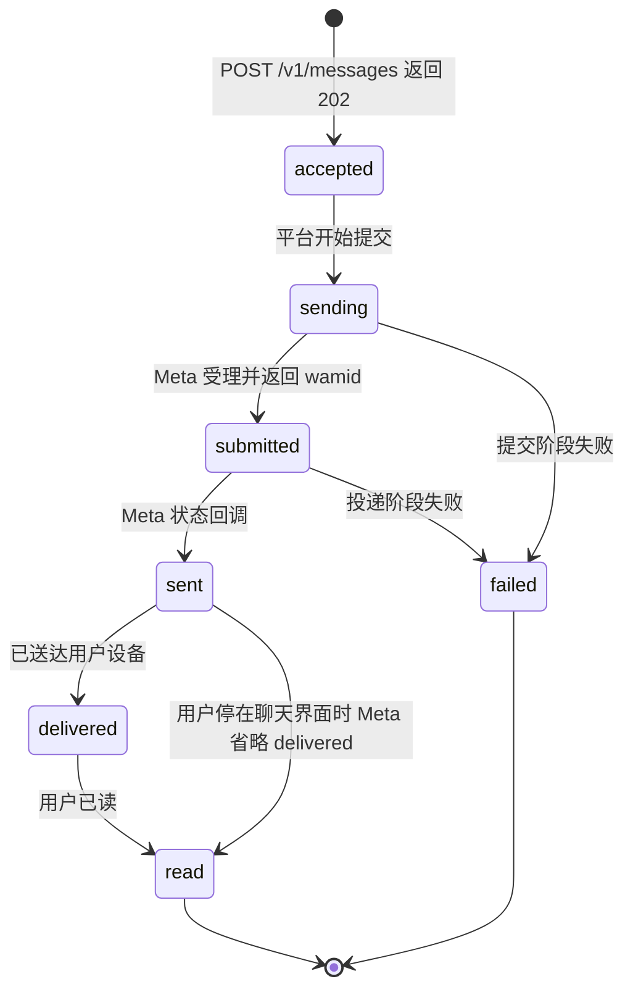

`POST /v1/messages` 的 `202 Accepted` 只代表「平台已受理」，不代表已送达，甚至不代表已提交给 Meta。追踪真实状态需要轮询 `GET /v1/messages/{id}` 或接收状态类 Webhook。

## 状态如何推进

| 状态        | 含义                                                                                                                             |
| ----------- | -------------------------------------------------------------------------------------------------------------------------------- |
| `accepted`  | 平台已受理请求，尚未提交给 Meta。                                                                                                |
| `sending`   | 正在提交给 Meta Cloud API。                                                                                                      |
| `submitted` | Meta 已受理并返回了 `wamid`，但还没有任何状态回调。**这不等于「已发送」**——Meta 文档里 `sent` 是独立的状态回调。                 |
| `sent`      | Meta 状态回调确认已发送到用户设备所在的运营商网络。                                                                              |
| `delivered` | 已送达用户设备。                                                                                                                 |
| `read`      | 用户已读。**可能不经过 `delivered` 直接到达**——用户当时正停在聊天界面时 Meta 会省略 delivered 回调。不要假设状态会逐级齐全出现。 |
| `failed`    | 终态。查 `GET /v1/messages/{id}` 返回的 `error` 字段（见[错误码](error-codes.md)页的消息失败码表）。                                    |

状态只会单调前进——迟到或重复的回调不会让状态往回跳（比如不会把已经是 `delivered` 的消息退回 `sent`）。

图里 `sent --> read` 这条边是最容易被漏掉的分支：**不要假设状态会逐级齐全出现**。

## 幂等与限流

建议每个业务事件生成一个稳定的 `Idempotency-Key`（≤200 字符）：在当前授权范围内重复 key 返回**原来那条**消息，不会重复发送，网络超时重试时这是唯一安全的做法。默认每个 API Key 对应的账户限流 600 条/分钟，超限返回 `429 RATE_LIMITED`，退避后重试即可。

## 24 小时客服窗口

距客户上一次主动发消息超过 24 小时后，只能发送已审核通过的**模板消息**，不能再发自由格式内容。平台会在落库前本地预判：确定超窗的自由格式消息直接返回 `409 WHATSAPP_24H_WINDOW_EXPIRED`（`details.customerAction` 给出下一步），不会浪费一次信用预留。但本地预判只覆盖"确定关闭"的情况——本地认为窗口开着而实际已关闭的消息，仍可能被 Meta 拒绝，走消息失败码的回落流程。

## 模板消息的参数绑定

`components` 里的 `parameters` 必须与创建模板时声明的占位符数量和顺序**完全一致**，否则 Meta 返回参数不匹配错误。模板发送前平台会校验该模板已审核通过（APPROVED）。模板消息不受 24 小时窗口限制，也是超窗场景下唯一可用的消息类型。

## 支持的消息类型

`POST /v1/messages` 的 `type` 有 11 个取值，同名字段承载内容：

| type | 用途 |
| ---- | ---- |
| `text` | 纯文本（可开 `preview_url` 做链接预览）。**省略 `type` 时按它处理。** |
| `template` | 已过审的模板消息。超出 24 小时窗口时唯一可用的类型。 |
| `image` / `video` / `audio` / `document` / `sticker` | 媒体消息。 |
| `interactive` | 按钮、列表、CTA URL、Flow、位置请求、地址收集——整个 `interactive` 对象原样透传给 Meta，所以 Meta 支持的子类型都能发。 |
| `location` | 发送一个地理位置（`latitude` / `longitude` 必填）。 |
| `contacts` | 发送联系人名片，一条消息最多 257 个。 |
| `reaction` | 对一条已有消息做 emoji 回应（`message_id` 必须是 `wamid.` 开头）。 |

各类型的必填/可选字段见[提交出站消息](../messaging/post-v1-messages.md)。形状不对的请求在**落库前**就返回 `400`，不会进入异步发送队列。

## 媒体消息

媒体有两种引用方式，**必须恰好给一个**：

- `id`：先用 `POST /v1/media?phoneNumberId=pn_...` 上传拿到 Meta 媒体 id。**上传接口对每个文件硬性限制 5 MB**，超过直接返回 `400`。
- `link`：一个 Meta 能公开访问到的 URL，由 Meta 自己去取。**大于 5 MB 的音视频和文档只能走这条路。**

两个都给或都不给都是 `400`（`provide exactly one of \`id\` or \`link\``）。

按类型的大小/格式限制（图片约 5MB、音视频约 16MB、文档约 100MB）由 **Meta 在投递阶段**校验，发送接口不预检——超限消息会先拿到 202，之后才通过状态回调变成 failed。Meta 的媒体 id 通常几天后失效，不要把同一个 id 当长期素材库用；临时下载 URL 5 分钟过期，长期保存请用 `GET /v1/media/{id}/content` 代理下载。

## 已读回执与输入指示器

`POST /v1/messages/read` 把一条入站消息标记为已读（可选附带"对方正在输入"指示器，约 25 秒内或对方收到下一条消息前有效）。它直连 Meta 实时接口、不产生计费、不占用发送配额。注意它跟收件箱的 `POST /v1/conversations/{id}/read`（只清平台本地未读数）是两件独立的事，互不联动。

## 广告带来的对话

从「点击进入 WhatsApp」广告点进来的客户，其第一条消息里带着广告点击 id，平台会存下来。要让 Meta 广告后台算出这条广告带来了多少成交，需要把转化事件报回去 —— 见[广告归因与转化上报](ctwa-attribution.md)。

## 计费时点

Meta 按**送达**计费，但平台在 Meta 受理并返回 `wamid` 时就会结算。之后状态回调确认 `failed` 的，平台自动把这笔费用冲回信用账户（幂等，不会重复冲）。所以"提交成功但投递失败"的消息最终不收费，不需要手动处理。详见[账务与信用额度](billing.md)。
