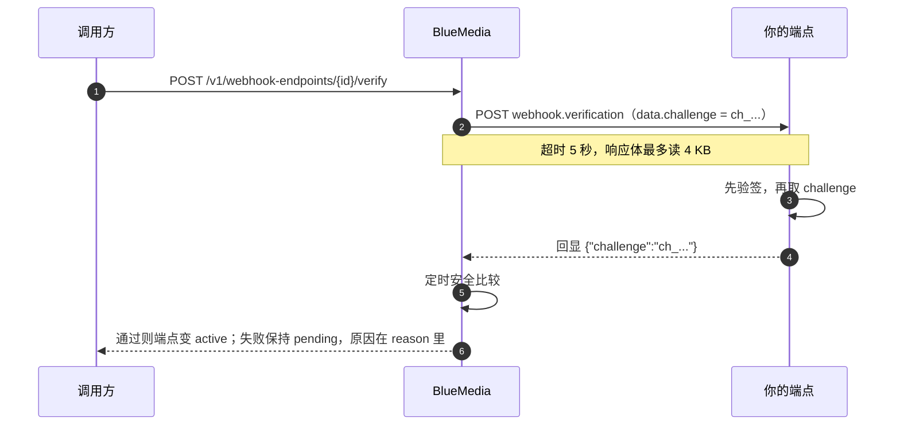

创建一个回调端点，接收用户消息、状态更新和号码/模板等资产变更，无需轮询。

## 创建端点

```bash
curl -X POST https://api.bsptest.com/v1/webhook-endpoints \
  -H "Authorization: Bearer <API_KEY>" \
  -H "Content-Type: application/json" \
  -d '{ "url": "https://your-server.example.com/whatsapp-webhook", "events": ["message", "status"] }'
```

`events` 可选，取值见下面的「事件类型」表；不填时平台按 `*`（全收，含日后新增的类型）保存。`secret` 可选，自己指定时**至少 16 字符**；不填则平台生成一个 `whsec_` 开头的随机值。**secret 只在创建响应里返回一次**，用来验证签名——请立即保存，平台之后不会再明文展示。

两个可选字段用于收窄和协议选择：

| 字段 | 作用 |
| ---- | ---- |
| `projectId` | 只接收该 Business Portfolio（`bm_...`）的事件。不传则是账户级端点，接收该账户下全部 Business Portfolio 的事件。**绑定了 Portfolio 的端点永远不会收到别的 Portfolio 的事件**；事件的归属解析不出来时也不会投给它（宁可漏投，不会投错对象）。 |
| `connectionId` | 走**连接协议**：换用下面的新签名方案，并且端点以 `pending` 起步、必须先通过所有权验证才开始投递。也可以写成 `metadata.connection_id`，两种写法等价。 |

`metadata` 可以放任意 JSON，平台原样保存并在读取端点时返回。

## 端点的状态

| 创建方式 | 初始 status | 说明 |
| -------- | ----------- | ---- |
| 不带 `connectionId` / `metadata.connection_id` | `active` | **立即开始投递**，不需要额外动作。 |
| 带 `connectionId` | `pending` | 先调 `POST /v1/webhook-endpoints/{id}/verify` 通过所有权验证才会变成 `active`，在此之前不投递。 |

`DELETE /v1/webhook-endpoints/{id}` 是**软停用**（status 变 `disabled`，投递停止，历史记录保留），响应体是停用后的端点对象而不是空 body。要恢复用 `POST /v1/webhook-endpoints/{id}/enable`：验证过的端点回到 `active`；没验证过的连接协议端点回到 `pending`（必须重新过验证，这一点不接受调用方指定）。

:::note

**轮换 secret 前先看这条。**`POST .../rotate-secret` 立即生效、没有重叠期：下一条投递就用新 secret 签名，你还没存好新值时收到的投递会验签失败，并按 4xx 判为**永久失败、不重试**。安全做法是低峰期轮换，或先 `DELETE`（停用）→ 轮换 → 存好 → `POST .../enable`。

:::

## URL 的限制

端点 URL 在创建和更新时都会做检查，不通过返回 `400 VALIDATION_FAILED`：

- 生产环境**必须是 https**；
- 主机名不能是 `localhost`、`metadata.google.internal` 这类内网名字；
- 解析出的地址不能落在私网、回环、link-local（含云元数据地址 `169.254.169.254`）、CGNAT 等保留网段——**每次投递前会再解析一次**，所以把域名事后改指到内网同样会被拦下。

## 所有权验证与测试

`POST .../verify` 和 `POST .../test` 走**同一套机制**（测试要回答的就是「这个地址能不能收、能不能验签」，另开一条路径会出现测试过了但真实投递失败）：

1. 平台同步 POST 一条 `webhook.verification` 事件到你的 URL，`data.challenge` 是一个 `ch_` 开头的随机值；
2. 你的端点先验签，再在响应体里把这个值原样回显——顶层 `{"challenge":"..."}` 或 `{"data":{"challenge":"..."}}` 都接受；
3. 平台用定时安全比较校验，通过则端点变 `active`。

挑战请求的超时是 **5 秒**（比常规投递短，因为调用方在等结果），响应体最多读 4 KB。失败**不会**改变 status——端点停在 `pending`，修好接收端再调一次即可；失败原因在响应的 `reason` 里。

挑战按**与真实事件完全相同的方式签名**，所以验证通过意味着后续真实事件也能验通。




## 验证签名

签名方案有两套，**由端点创建时是否走连接协议决定**。读取端点时返回的 `apiVersion` 为 `null` 就是下面第一套。

### 默认方案（`apiVersion: null`）

每次回调带 `X-Webhook-Signature-256: sha256=<hex>`，是对**原始请求体字节**用端点 secret 做 HMAC-SHA256 的结果。收到回调后必须先验证，再解析 JSON——用同样的算法自己算一遍，和 header 比对：

```js
const crypto = require('node:crypto');

function verify(rawBody, signatureHeader, secret) {
  const expected = 'sha256=' + crypto
    .createHmac('sha256', secret)
    .update(rawBody)      // 必须是原始字节，不能是解析后再 JSON.stringify 的结果
    .digest('hex');
  return crypto.timingSafeEqual(Buffer.from(expected), Buffer.from(signatureHeader));
}
```

其余请求头：`X-Webhook-Event`（本次事件类型，见下）、`X-Delivery-Id`（这次投递的唯一 id，用于对账/去重）。

### 连接协议方案（`apiVersion` 非 null）

带 `connectionId` 创建的端点改用四个头，**上面那三个头不会出现**：

| 请求头 | 含义 |
| ------ | ---- |
| `Webhook-Id` | 事件 id，用于幂等去重。平台事件是 `evt_...`；Meta 入站事件的扇出走投递 id（`wd_...`） |
| `Webhook-Endpoint-Id` | 端点 id（`whe_...`） |
| `Webhook-Timestamp` | 签名时的 unix 秒 |
| `Webhook-Signature` | `v1,<hex>` |

`<hex>` 是 `HMAC_SHA256(secret, "<Webhook-Timestamp>.<原始请求体>")`。**时间戳参与签名**而不只是一个头，所以它本身不可篡改，接收方可以据此拒绝容忍窗口之外的重放：

```js
const crypto = require('node:crypto');

function verifyV1(rawBody, timestampHeader, signatureHeader, secret) {
  const [version, provided] = String(signatureHeader).split(',', 2);
  if (version !== 'v1' || !provided) return false;
  const expected = crypto
    .createHmac('sha256', secret)
    .update(`${timestampHeader}.${rawBody}`)   // 同样必须是原始字节
    .digest('hex');
  if (expected.length !== provided.length) return false;
  return crypto.timingSafeEqual(Buffer.from(expected), Buffer.from(provided));
}
```

## 事件类型

`X-Webhook-Event`（或连接协议事件信封里的 `type`）的取值分两类，**订阅时写在同一个 `events` 数组里**：

Meta 入站事件：

| kind      | 触发时机                                                                           |
| --------- | ---------------------------------------------------------------------------------- |
| `message` | 用户发来一条新消息（含图片/文档/位置等各类型）。                                   |
| `status`  | 你发出的消息状态变化：`sent` / `delivered` / `read` / `failed`。                   |
| `change`  | 其它资产变更（号码、模板审核结果等），不属于上面两类的统一归到这里。               |
| `probe`   | Meta 向平台回调了一个**解析不出任何已知事件**的请求体时的兜底分类（Meta 的连通性探测、或我们尚未识别的新 payload 形状）。`value` 里是原始请求体。它**不是**控制台「测试」按钮——那个发的是 `webhook.verification`。 |

平台事件：

| kind                  | 触发时机                                                       |
| --------------------- | -------------------------------------------------------------- |
| `job.completed`       | 平台侧的异步任务完成。                                         |
| `job.failed`          | 平台侧的异步任务失败。                                         |
| `usage.updated`       | 用量数据发生变化。                                             |
| `webhook.verification` | 所有权验证/测试的挑战事件（见上一节）。                        |

`*` 表示全收，**包含日后新增的类型**。不支持 `job.*` 这样的前缀通配——只有精确值和 `*`。

## 投递与重试

你的端点返回 `2xx` 视为投递成功。`5xx`、`429` 和网络层失败视为临时故障并重试；其它 `4xx`（如签名校验失败后你主动拒绝）视为终态失败，**不会**重试——请确保你的端点对瞬时故障返回 5xx 而不是 4xx。单次请求超时 10 秒。

重试节奏是一张**固定表**，不是指数退避。首次投递之后最多重试 7 次，**合计 8 次尝试**：

| 第几次重试 | 距上一次失败 |
| ---------- | ------------ |
| 1 | 立即 |
| 2 | 1 分钟 |
| 3 | 5 分钟 |
| 4 | 30 分钟 |
| 5 | 2 小时 |
| 6 | 12 小时 |
| 7 | 24 小时 |

前段「立即 + 1 分钟」覆盖绝大多数瞬时故障，后段拉到小时级是为了给接收方的运维留出修复时间。**整个重试窗口约 38.6 小时**；8 次之后放弃，不会无限重试。

因为重试存在，投递是**至少一次**语义：请按事件 id（默认方案用 `X-Delivery-Id`，连接协议用 `Webhook-Id`）做幂等。

`GET /v1/webhook-endpoints` 返回每个端点**最近一次**投递的结果（`lastDelivery`：状态/响应码/尝试次数/最近错误/时间），从未投递过为 `null`。这里刻意不提供「已投递/失败/待投递」的计数——那类聚合会随消息量增长变慢，「最近一次成功了吗」才是真正需要的信号。

## Payload 结构

有两种形状，和签名方案配套出现。

每种事件都有可直接用于 Ajv、JSON Schema Validator 或代码生成器的独立 Schema，入口见 [OpenAPI 与 Agent 接入](../reference/openapi.md)。OpenAPI 3.1 的 `webhooks` 节也引用同一组契约。

### Meta 入站事件（扇出，配默认签名方案）

回调体是 `{ kind, ...上下文字段, message / status / value }` 的形态，字段随 `kind` 变化：

```json title="status 事件示例"
{
  "kind": "status",
  "wabaId": "waba_...",
  "phoneNumberId": "pn_...",
  "status": {
    "id": "wamid.HBg...",
    "status": "delivered",
    "timestamp": "1735000000",
    "recipient_id": "8613800138000"
  }
}
```

### 平台事件信封（配连接协议签名方案）

平台自己发布的事件（`job.*` / `usage.updated` / `webhook.verification`）用一个固定信封，业务内容在 `data` 里：

```json title="webhook.verification 示例"
{
  "id": "evt_...",
  "type": "webhook.verification",
  "api_version": "2026-01-01",
  "created_at": "2026-09-20T10:00:00.000Z",
  "account_id": "tenant_...",
  "project_id": "bm_...",
  "data": { "challenge": "ch_..." }
}
```

`project_id` 在账户级端点上为 `null`。`created_at` 恒为 UTC、毫秒精度。
