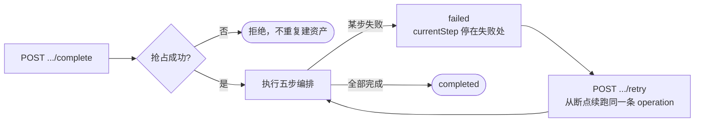

这套 API 在四个地方做了幂等保证。搞清楚各自的作用域，就不会出现重复扣费或重复建资产。

## 请求幂等（Idempotency-Key）

给 `POST /v1/messages` 带一个稳定的 `Idempotency-Key`（≤200 字符）：

```bash title="重试网络超时的请求"
curl -X POST https://api.bsptest.com/v1/messages \
  -H "Authorization: Bearer <API_KEY>" \
  -H "Idempotency-Key: order-8821-notify" \
  -H "Content-Type: application/json" \
  -d '{ "phoneNumberId": "pn_01923abc", "to": "8613800138000",
        "type": "text", "text": { "body": "你的订单已发货" } }'
```

- 在**当前授权范围内**重复使用同一个 key，返回*原来那条*消息，不会重复发送。
- 同一个 key 配上**不同的请求内容**会返回 `409 IDEMPOTENCY_CONFLICT`——这是在提醒你 key 生成逻辑有问题，不要靠改 key 绕过。

:::tip

建议每个**业务事件**生成一个 key（如 `order-8821-notify`），而不是每次 HTTP 调用生成一个。网络超时重试时这是唯一安全的做法。

:::

## 账本幂等

账本是追加式的（只插不改），同一幂等键只会入账一次：

- 结算在 Meta 返回 `wamid` 时发生。
- 状态回调 `failed` 时自动冲回，冲回记录的幂等键按消息 id 生成，**重复回调不会重复冲**。

所以「提交成功但投递失败」的消息最终不收费，不需要人工处理。详见[账务与信用额度](../guides/billing.md)。

## 接入编排的原子抢占

邀请链接的 `complete` 接口先做**原子抢占**（要求邀请处于 pending 且未过期）再执行编排，因此客户在落地页上双击提交**不会产生两套资产**。

失败后必须调 `retry` **续跑同一条 operation**：



:::danger

失败后重新 `POST` 创建接口会**新建一条全新 operation**，不是续跑。重试时也只允许换 `code`——`wabaId` / `phoneNumberId` 在首次提交时已绑定，更换目标资产会被拒绝。

:::

额度授权同样幂等：Business Portfolio 已授权时不会重复授权，WABA 已挂载时不会重复调用 Meta。

## Webhook 的至少一次投递

因为存在重试，投递是**至少一次**语义。请按事件 id 做幂等去重：

| 签名方案 | 去重用的头 |
| --- | --- |
| 默认方案（`apiVersion: null`） | `X-Delivery-Id` |
| 连接协议（`apiVersion` 非 null） | `Webhook-Id` |

重试节奏是一张**固定表**，不是指数退避。首次投递之后最多重试 7 次，合计 8 次尝试：

| 第几次重试 | 距上一次失败 | 累计耗时 |
| --- | --- | --- |
| 1 | 立即 | ~0 |
| 2 | 1 分钟 | 1 分钟 |
| 3 | 5 分钟 | 6 分钟 |
| 4 | 30 分钟 | 36 分钟 |
| 5 | 2 小时 | 2.6 小时 |
| 6 | 12 小时 | 14.6 小时 |
| 7 | 24 小时 | 38.6 小时 |

前段「立即 + 1 分钟」覆盖绝大多数瞬时故障，后段拉到小时级是给接收方的运维留修复时间。8 次之后放弃，不会无限重试。

:::warning

`5xx`、`429` 和网络层失败才会重试；**其它 `4xx` 视为终态失败、不重试**。所以请确保你的端点对瞬时故障返回 5xx 而不是 4xx——验签失败时主动返回 4xx 会让这条事件永久丢失。

:::

完整的签名验证代码见 [Webhook 集成](../guides/webhook-integration.md)。
